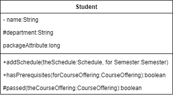

# 10주차 목차
[1차시 - 코딩 ]()

[]()

[]()

## 1차시 - 코딩
### 클래스의 구현
- 클래스 다이어그램에서의 클래스를 코드로 구현



&nbsp;&nbsp;&nbsp;&nbsp;&nbsp;&nbsp;&nbsp;&nbsp;&nbsp;&nbsp;&nbsp;&nbsp;&nbsp;&nbsp;&nbsp;&nbsp;&nbsp;&nbsp;&nbsp;&nbsp;&nbsp;&nbsp;&nbsp;&nbsp;&nbsp;&nbsp;&nbsp;&nbsp;&nbsp;&nbsp;&nbsp;&nbsp;&nbsp;&nbsp;&nbsp;&nbsp;&nbsp;&nbsp;&nbsp;&nbsp;&nbsp;&nbsp;&nbsp;&nbsp;&nbsp; &dArr;

```java
public class Student()
{
    private String name;
    protected String department;
    long packageAttribute;
    public void addSchedule(Schedule theSchedule, Semester for Semester){
    }
    public Boolean hasPrerequisites(CourseOffering forCourseOffering){
    }
    protected Boolean passed(CourseOffering theCourseOffering){
    }
}
```

### 상속 관계의 구현


### 인터페이스 구현 관계의 구현


### 1대1 연관 관계의 구현


### 1대다 연관 관계의 구현


---
## 2차시 - 코딩
### 리팩토링
#### Refactoring
- 코드의 실행 결과 변경 X, 코드의 디자인만 안전하게 향상

#### 목적
- 코드 디자인 개선
- 코드 이해도&uarr;
- 버그를 찾는데 도움을 줌
- 프로그램 개발 기간 단축

#### 리팩토링 과정


### 코드 스멜
#### Code smell
- 코드에 문제가 있음을 알려주는 징후
- 리팩토링에 의해 제거 가능

#### 종류
- 중복된 코드
- 긴 메서드
  - 코드 리뷰시 이해에 부정적 영향을 줌
  - 5~10줄 정도가 넘어가면 의심해볼 수 있음
- 다른 클래스를 지나치게 애용
- 메시지 체인
  - ex) Parents.child.stat.age;

---
## 3차시 - 코딩
### 중복 코드
#### 정의
- 한 번 이상 반복되어 나타나는 소스코드
- 코드 clone 또는 clone이라고도 함

#### 발생 이유
- Copy and paste programming
  - 붙여 넣은 후 변수 이름 바꿈이나 코드의 추가, 삭제 등의 변형
- 기능적으로 비슷한 것을 다른 프로그래머가 구현할 때
- 표절

#### 문제점
- 코드 중복으로 코드 양&uarr; &rarr; 프로그램 이해도&darr;
- 유사한 코드 간의 차이점은 무엇인지 명시적으로 들어나지 않음
- 비정상적인 갱신 발생 가능

#### 타입
##### type 1
- 공백이나 탭의 차이
- 가장 비슷한 코드

##### type 2
- type 1 + 변수 이름까지 다름

##### type 3
- type 2 + 타입, 레이아웃, 주석까지 다름

##### type 4
- 기능만 같고 나머지가 다름
- ex) 피보나치 함수를 직접 구현, 재귀로 구현