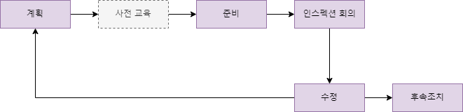
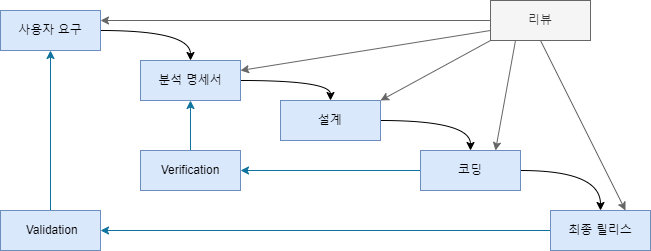
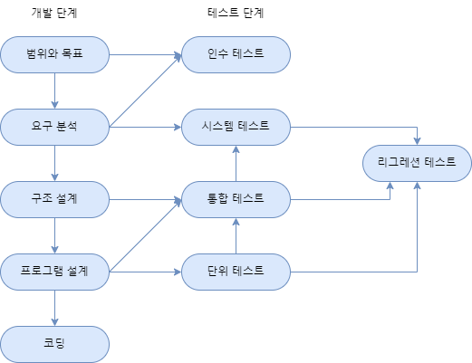

# 11주차 목차
[1차시 - 코딩_리팩토링 지원 IDE](#1차시---코딩)

[2차시 - 코딩_품질 향상 기법](#2차시---코딩)

[3차시 - 테스트](#3차시---테스트)

## 1차시 - 코딩
### 자동화된 리팩토링을 지원하는 IDE
- Eclipse
  - 주로 자바 프로그램의 리팩토링 지원
- IntelliJ IDEA
  - 자바
- Visual Studio
  - .NET, C++

---
## 2차시 - 코딩
### 코드 품질 향상 기법
#### 리팩토링
#### 테스트
#### 코드 인스펙션(Inspection)
- 설계와 코드의 품질 향상을 위해 Fagan이 처음 제안

종류
- 코드 인스펙션
- 설계 인스펙션

코드 인스펙션의 목적
- 코드에 잠재되어 있는 결함을 찾아냄
- 품질 이슈를 검사함

보통 코드 인스펙션은 정적 분석 도구에 의해 검사된 후에 체크리스트를 사용해 이루어짐

팀 구성
- 주재자(mderator)
  - 검사 회의를 진행하는 의장
- 저자
  - 검사 대상이 되는 프로그램을 작성한 사람 중 한 명
- 기록자(recorder)
  - 검사 중에 발견된 결함을 기록하고 그 결과를 배포함
- 낭독자(reader)
  - 코드를 읽고 해석하는 사람, 보통 팀 내에서 가장 많은 도메인 지식을 가진 사람이 맡음
- 검사자(inspector)
  - 코드의 문제점을 찾아내는 사람

과정

1. 계획
   - 주재자가 인스펙션의 작업과 과정 확립
2. 사전 교육
   - 인스펙션 작업이 원활히 진행될 수 있도록 저자가 팀원들에게 검사 대상의 소프트웨어를 설명함
3. 준비
   - 인스펙션 회의 전, 각자 역할별로 인스펙션 자료 검토 및 문제점 메모
4. 인스펙션 회의
   - 팀원들이 미팅하여 각자 역할에 따라 검사 수행
   - 발견된 문제점 기록 및 저자에게 전달 &rarr; 수정
5. 수정
   - 저자는 발견된 문제점 수정
6. 후속조치(follow-up)
   - 주재자는 발견된 문제점들이 수정되었는지 확인함

#### 정적 분석
Static Analysis
- 프로그램을 실행하지 않고 소스 코드를 체계적으로 분석하여 결함을 찾아내는 작업

정적 분석은 코드 인스펙션과는 다르게 보통 자동화된 소프트웨어 도구를 이용하여 이루어짐

보통 정적 분석은 결함으로 나타날 비정상적이거나 원하지 않는 패턴을 찾음
- ex) dead code, data anomaly etc..

Dead Code
- 실행은 되지만 그 결과가 어디에도 사용되지 않는 불필요한 코드

Data Anomaly
- 전형적인 data anomaly
  - 변수의 값이 정의되지 않고 사용
  - 정의된 변수가 어디에서 사용되지 않음
- data anomaly를 발견하려면 프로그램의 제어 흐름과 자료흐름을 분석해야 함
- 판단
  - 변수의 값이 정의되지 않고 사용되는가?
  - 정의된 변수가 어디에서도 사용되지 않는가?

---
## 3차시 - 테스트
### 테스트란?
#### 소프트웨어 테스트
- 소프트웨어의 결함이나 오작동을 찾아내고 소프트웨어가 요구와 제약에 맞는지 검증

#### 소프트웨어 개발은 인간 중심의 활동으로 실수가 발생하기 쉬운 활동
#### 결함을 낮추는 방법
- 결함 방지
  - 인스펙션, 정적분석
- 결함 식별 및 제거
  - 테스트, 디버깅

#### 검증과 확인(V & V)
검증(Verification)
- 현 단계의 산출물이 이전 단계의 산출물과 일치하는지를 검증

확인(Validation)
- 산출물이 사용자 요구를 만족하는지를 결정
  
V & V는 테스트보다 더 일반적인 용어

### 테스트의 분류
#### 실행 유무에 따른 분류
실행 기반 테스트
- 동적 테스트라고도 함

비실행 기반 테스트
- 정적 테스트라고도 함
  - ex) Inpection, 정적분석

#### 테스트 목적에 따른 분류
결함 테스트
- 결함 발견

Recovery test(복구 테스트)
- 고장을 유발하여 시스템의 복구 능력 시험

Security test(보안 테스트)
- 시스템의 보안 취약점 발견

Performance test(성능 테스트)
- 시스템의 성능 효율 평가

UI test(유저 인터페이스 테스트)
- 사용자 화면이 시스템의 기능을 작동할 수 있도록 적절히 설계되었는지 평가

Benchmark test
- 동일한 기준에 의한 성능 비교 평가
  
#### 개발 단계에 따른 분류
단위 테스트
- Unit, module, component test
- *개발 환경*에서 모듈 작성자에 의해 수행

통합 테스트
- Integration test
- *개발 환경*에서 개발팀이나 SQA팀에 의해 수행

시스템 테스트
- 시스템의 다양한 측면 시험
  - 기능, 성능, 보안 등
- 실제 환경과 유사한 *시험 환경*에서 SQA 팀에 의해 수행

인수 테스트
- acceptance test
- 시스템이 사용할 수 있도록 모든 준비가 되어 있는지를 보임
- 실제 환경에서 사용자에 의해 수행됨

###### 테스트 단계와 소프트웨어 개발 단계의 관계

### 테스트 용어
#### 버그(bug)
문제, 결함 등을 나타낼 때 일반적으로 사용되는 용어
#### 실수(mistake)
개발자가 설계나 코딩 시에 행한 인간의 실수
#### 오류(error)
올바르지 않은 프로그램의 내부 상태
#### 결함(fault)
오류를 일으키게 하는 원인
#### 고장(failure)
소프트웨어가 명세와 다르게 동작하는 것이 외부에서 관찰되는 상황
- 오작동이라고 하기도 함

고장은 결함에 의해 발생
- 그러나 결함이 있다고 해서 반드시 고장이 발생하지는 않음
