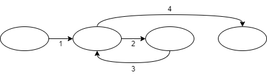

# 13주차 목차
[1차시 - 테스트_테스트 커버리지](#1차시---테스트)

[2차시 - 테스트_기본경로 커버리지](#2차시---테스트)

[3차시 - 테스트_통합 테스트](#3차시---테스트)

## 1차시 - 테스트
### Test Coverage
#### 테스트가 프로그램의 코드를 어느정도 실행해 봤는가를 나타내는 기준
- 테스트를 언제 종료해야하는지를 나타내는 기준으로 사용 가능
#### Test coverage의 종류
- 문장 coverage
- 분기 coverage
- 경로 coverage
  - 기본 경로 coverage
  - 모든 경로 coverage

#### 문장 Coverage
- 논리 흐름도의 각 노드가 적어도 한번은 방문되고 있는가를 나타내는 기준
  - 즉, 코드의 모든 문장을 적어도 한 번 이상 실행하는가?
- 노드 coverage, 블록 coverage 라고도 함
- 가장 기본적인 커버리지임
- 100% 달성을 위해서 프로그램 내의 모든 문장을 적어도 한번은 실행해야 함
- 문장 coverage 공식 = $\frac{실행 문장}{전체 문장}*100$

#### 분기 Coverage
- 논리 흐름도의 각 간선이 적어도 한번은 방문되고 있는가를 나타내는 기준
  - 즉, 코드의 모든 분기들을 한 번 이상 실행하는가?
  - 간선 coverage라고도 함
  - 노드 커버리지보다 강한 기준임
  - 분기 coverage 공식 = $\frac{실행분기}{전체분기}*100$

#### 기본 경로
- Base path
- 다른 프로그램 경로들을 만들 수 있는 경로
- 루프를 최대 한번만 허용하는 경로만 기본 경로가 될 수 있음
  - 즉, 기본 경로에는 2번이상 순회하는 경로가 없어야 함

- 기본 경로
  - 1,4
  - 1,2,3,4
- 기본 경로가 아닌 것
  - 1,2,3,2,3,4

#### 싸이클로매틱 복잡도
- Cyclomatic complexity
- 프로그램의 복잡도를 나타내는 척도 중 하나
- CC(G) = 간선 수 - 노드 수 + 2
- 싸이클로매틱 복잡도는 기본 경로 수와 같음

---
## 2차시 - 테스트
#### 기본 경로 Coverage
- 선형 독립인 기본 경로들이 적어도 한 번 이상 실행되고 있는가를 나타내는 기준
- 일반적으로 100%의 분기 커버리지는 기본 경로 커버리지를 100% 만족하지 않음
- 기본 경로 coverage 공식 = $\frac{실행된 기본경로}{사이클로매틱} * 100$
#### 모든 경로 Coverage
- 가능한 모든 경로를 적어도 한번은 방문하고 있는가를 나타내는 기준
  - 즉, 코드의 모든 경로들이 한 번 이상 실행되고 있는가?
- Loop를 포함할 경우 모든 경로 커버리지를 100% 만족하는 것은 불가능함
  
### 상태기반 테스트
#### 상태에 의해 동작이 좌우되는 시스템의 테스팅에 유용한 방법
#### 상태 다이어그램에 적용할 수 있는 test coverage
- 모든 트랜지션(간선)
  - 상태 다이어그램의 모든 트랜지션을 점검해야 하는 기준
- 모든 트랜지션 쌍
  - incoming과 outgoing transition 들 간의 모든 가능한 쌍을 점검해야 하는 기준
- 트랜지션 트리
  - 모든 단순 경로를 점검해야 하는 기준
    - 단순 경로 : 시작 상태에서 다른 상태로 중복되지 않게 방문되는 경로
    - 단순 경로 $\neq$ 기본 경로

---
## 3차시 - 테스트
### 통합 테스트
#### 목적
- 시스템을 구성하는 모듈들의 인터페이스와 상호작용을 테스트함
#### 용어
- stub : 테스트 모듈의 하위 모듈을 모방하는 모의 모듈
- driver : 테스트 모듈의 상위 모듈을 모방하는 모의 모듈
#### 방법
- 모듈의 결합 순서에 따라 다름
  - Big Bang
  - Bottom Up
  - Top Down

### Big Bang 통합 테스트
#### 모든 모듈을 한꺼번에 통합하여 테스트
#### 장점
- 테스트에 소요되는 자원이 일시에 요구
  - 수행 절차 간편, 효율적으로 테스트 자원 사용 가능
- 통합을 위해 stub을 구성할 필요 X
#### 단점
- 오류의 위치와 원인을 파악하기가 어려움
  - 점증적으로 이루어지지 않음
- 테스트 일정 계획에 융통성 X
  - 모든 모듈이 구현되어야만 테스트 가능
- 시스템의 중요 부분과 부수적인 부분 구별 X

### Top Down 통합 테스트
#### 상위 계층의 모듈부터 시작하여 점증적으로 하위 계층의 모듈들을 추가하면서 테스트가 이루어짐
#### 테스트시 stub 모듈 요구
#### 상위 계층의 모듈은 하위 계층의 모듈보다 먼저 구현되어 있어야 함
#### 장점
- 점증적 통합이므로 테스트에 소요되는 자원 분산
- stub의 사용으로 시스템의 모습을 사용자에게 조기에 보여줄 수 있음
- 시스템의 계층 구조와 상위층의 주요 인터페이스 조기에 시험 가능
- 결함 발견 쉬움
#### 단점
- 입출력을 수행하는 모듈이 대부분 최하위에 존재 &rarr; 테스트 어려움
- 하위 계층 모듈 충분한 테스트 불가

### Bottom Up 통합 테스트
#### 하위 계층의 모듈부터 시작하여 점증적으로 상위 계층의 모듈들을 추가하며 테스트가 이루어짐
#### 테스트시 드라이버 모듈 요구
#### 하위 계층의 모듈이 상위 계층보다 먼저 구현되어 있어야 함
#### 장점
- 점증적 통합 방식
  - 결함 발견 쉬움
  - 테스트에 소요 자원 분산
- 하위 모듈이 상위 모듈에 비해 더 철저히 테스트
#### 단점
- 초기에 시스템의 뼈대가 갖추어지지 않음
  - 시스템 아키텍처가 통합 후반부에 완성
- 시스템의 architectural fault(구조적 결함)가 늦게 노출
  - 구조적 결함이 늦게 발견되면 이를 고치기 위해 하위 모듈의 상당 부분을 수정해야 할 수도 있음